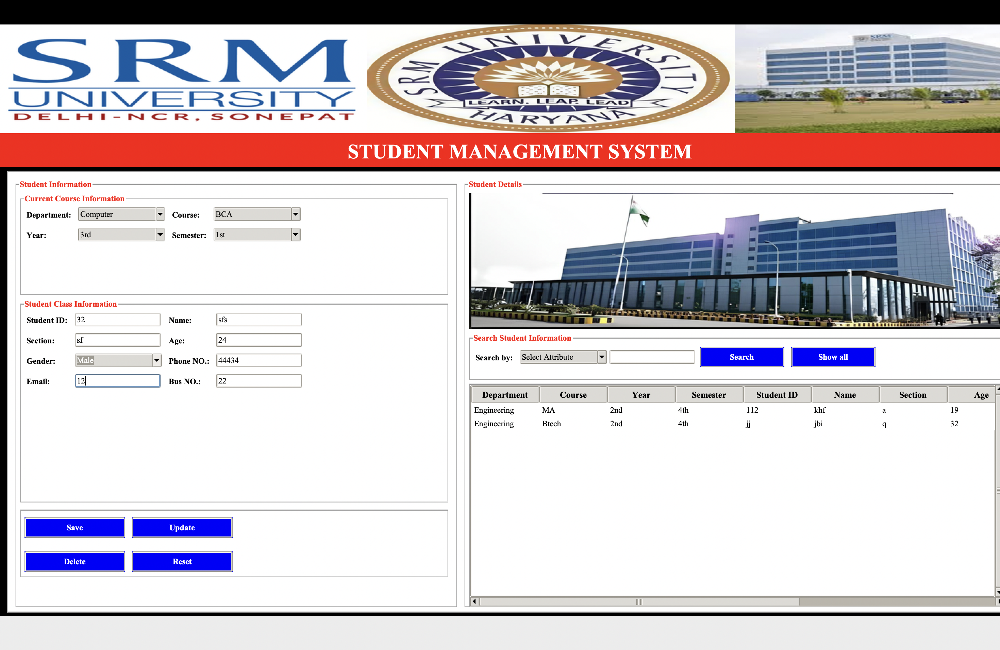

# 🧑‍🎓 Student Database Management System – Tkinter + MySQL

A clean, simple **Python desktop app** built using **Tkinter for GUI** and **MySQL** as the backend. The system supports full CRUD operations on student records and is designed with modularity and ease-of-use in mind.



---

## 🚀 Features

- ➕ **Add Students** – Add new student records via form inputs
- 🔁 **Update Info** – Modify existing student data
- ❌ **Delete Records** – Remove unwanted entries
- 📋 **View All** – Tabular view of all students
- 🔍 **Search by ID/Phone/Email**
- 🧹 **Clear Fields** – Reset all input fields

---

## 📦 Tech Stack

- **Python 3.x**
- **Tkinter**
- **MySQL** (local server)
- **mysql-connector-python**
- **Pillow**

---

## 🧰 Installation & Setup

### 1. Clone the Repository
```bash
git clone https://github.com/Luckyjaglan/Student-Management-System-Tkinter-MySQL.git
cd Student-Management-System-Tkinter-MySQL
```

### 2. (Optional) Create Virtual Environment
```bash
python3 -m venv venv
# Windows: .\venv\Scripts\activate
# Mac/Linux: source venv/bin/activate
```

### 3. Install Requirements
```bash
pip install -r requirements.txt
```

### 4. Set Up MySQL Database
```bash
mysql -u root -p
SOURCE schema.sql;
```
🔐 **Database Credentials**  
> The app no longer stores your database password in code.  
> You'll be securely prompted or should configure a `.env` file or other secure method locally.

📁 *Tip:* If you're using a `.env` file to manage secrets, make sure to include `.env` in your `.gitignore`.

---

## ▶️ Run the App

```bash
python main.py
```

---

## 📁 Project Structure

```
├── main.py              # Entry point
├── gui.py               # GUI logic with Tkinter
├── database.py          # MySQL database interactions
├── schema.sql           # SQL schema file
├── requirements.txt     # Python dependencies
├── Management Images/   # GUI assets
│   └── ...images
└── README.md
```

---

## 🗺️ Roadmap

- [ ] Export data as CSV/PDF
- [ ] Add login/authentication
- [ ] Improve GUI (dark mode)
- [ ] Add unit testing

---

## 🤝 Contributing

Pull requests are welcome! For major changes, open an issue first to discuss what you’d like to change.

---
